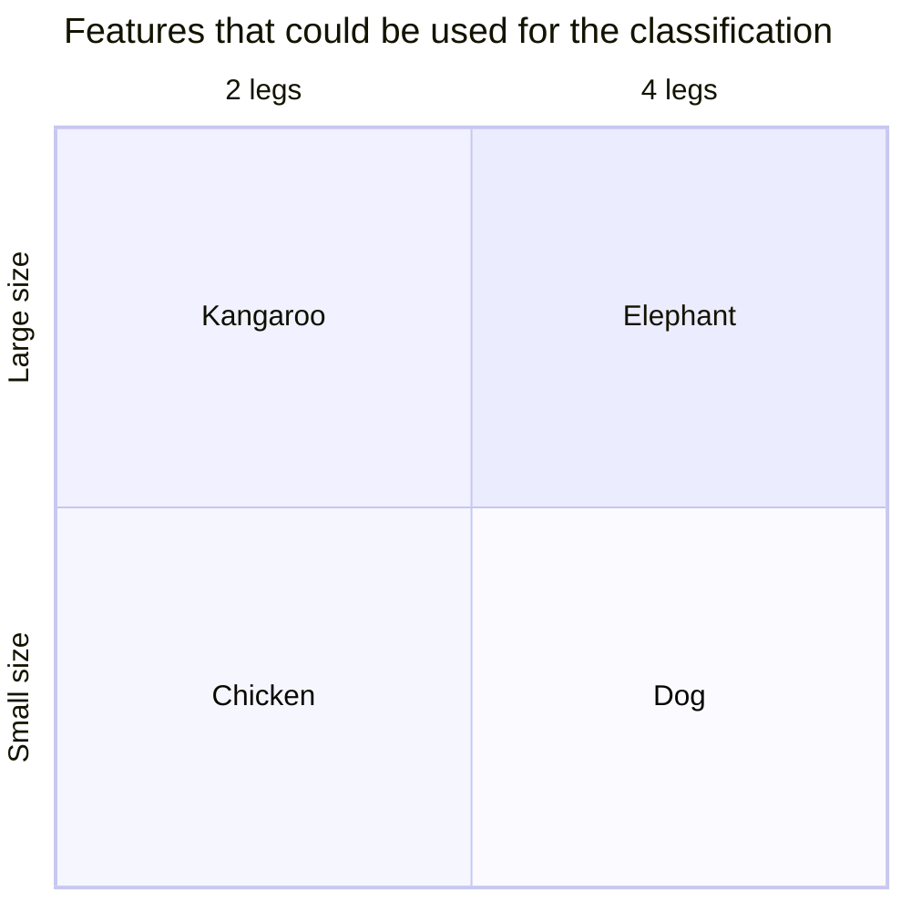

# How the ML part is implemented?
Check the [`viz.ipynb`](viz.ipynb) notebook for a step-by-step exploration of the data and the design of the machine learning approach.

As a overview, we will exploit the following domain knowledge to classify the animals:

For an actual implementation of the machine learning model, check the [`ml.ipynb`](ml.ipynb) notebook.

With this complete, let's implement the backend using the trained model.