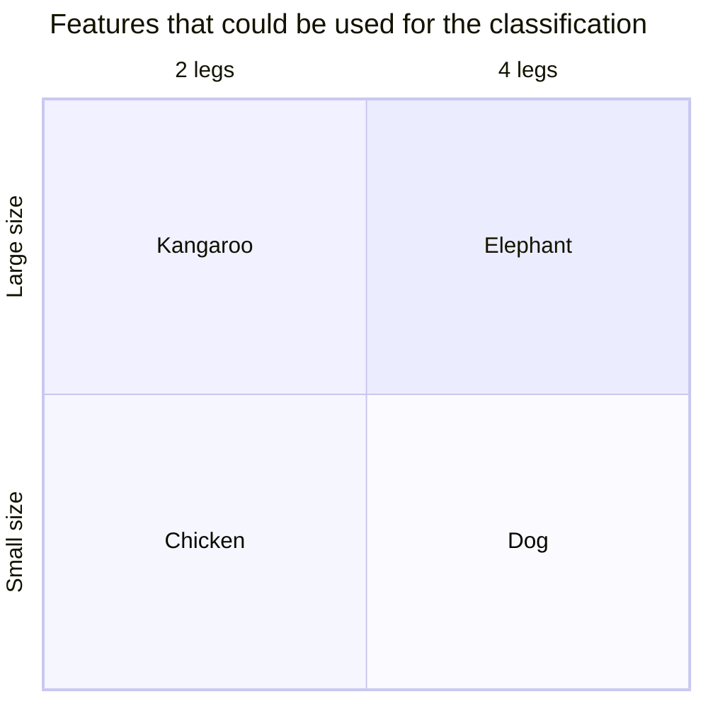

# How the ML part is implemented?
Check the [`viz.ipynb`](viz.ipynb) notebook for a step-by-step exploration of the data and the design of the machine learning approach.

As a overview, we will exploit the following domain knowledge to classify the animals:



For an actual implementation of the machine learning model, check the [`ml.ipynb`](ml.ipynb) notebook.

With this complete, let's implement the backend using the trained model.

# How the backend is implemented?
The backend is implemented using the FastAPI framework as a Python package.

# Deployment
First, the backend depends on S3-like storage to store the trained model. We will use MinIO for this purpose. To deploy MinIO, run the following command:

```bash
$ docker run -p 9005:9000 -p 9006:9001 minio/minio server /data --console-address ":9001"
```

For instructions on how to deploy the backend run:

```bash
# Install the package including the development dependencies
$ pip install -e '.[dev]'
# Run the backend
$ python -m py_challenge_backend run --help
```

## Deployment on Docker

To build the image run:
```bash
$ docker build -t py_challenge_backend:latest .
```

Then to run the API use:
```bash
$ docker run -p 8778:8778 py_challenge_backend:latest
```

# Running the tests
To run the tests, execute the following command:

```bash
$ coverage run -m pytest tests/
$ coverage report
```